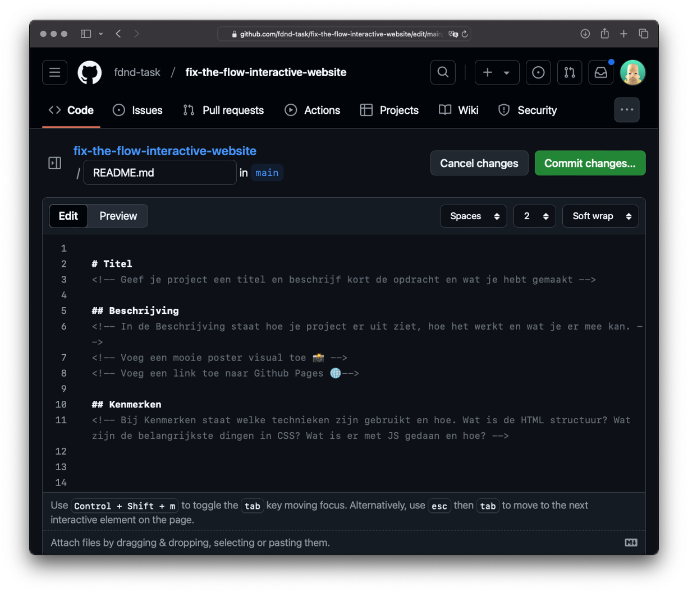

# Fix the Flow - Interactive Website

## Wrap up

Tijdens de *Wrap up* ga je de (laatste) sprint review met de opdrachtgever voorbereiden. 

### Sprint Review voorbereiden

Dit is de laatste sprint dit semester dat je voor de opdrachtgever hebt gewerkt. *Let's go  out with a bang!*

Tijdens de sprint review ga je eerst laten zien welke feedback je hebt verwerkt na sprint 4. Daarna ga je je interacties presenteren.

### Feedback en fixes deze sprint

Pak de feedback van de opdrachtgever van de vorige sprint review er nog een keer bij, maak een lijst(je) en noteer welke feedback je hebt verwerkt. Tijdens de Sprint Review ga je stap voor stap de lijst bespreken, benoem de feedback en laat zien hoe je dat hebt opgelost. Vraag wat de opdrachtgever ervan vindt en noteer de opmerkingen. 

Doorloop de workshop uit Sprint 2 voor een goede voorbereiding: https://github.com/fdnd-task/the-client-website/blob/main/docs/sprint-review.md

### Interactie presenteren in de Readme

Na de lijst met de feedback die je hebt verwerkt ga je je interactie(s) presenteren. Dit doe je aan de hand van je Readme. 
Omdat je deze sprint een of meerdere interacties hebt gemaakt, kan je deze mooi tonen in de Readme en dit gebruiken om te presenteren. In de Readme schrijf je in principe niets over het proces dat je hebt doorlopen, maar focus je op het eindresultaat.

#### Titel
Begin de Readme met een goede titel en een korte uitleg over de opdracht en wat je hebt gemaakt. Dit is het "ontwerpprobleem" en de "oplossing".

#### Beschrijving
Bij 'Beschrijving' komt te staan hoe je project er uit ziet, hoe het werkt en wat je er mee kan. 

Laat hier de interactie(s) zien die je hebt gemaakt. Toon een visual van de interactie en leg je ontwerpkeuzes uit. Je ontwerpkeuzes kan je uitleggen door te schrijven en laten zien hoe je feedback en feedforward hebt toegepast in je ontwerp, dat je gebruik hebt gemaakt van labels of andere principes. Je kan ontwerpkeuzes ook uitleggen met bevindingen uit de user test, de gebruiker heeft altijd gelijk ... Link naar de live pagina met de interactie.

#### Kenmerken 
Bij 'Kenmerken' staat welke technieken zijn gebruikt en hoe. Wat is de HTML structuur? Wat zijn de belangrijkste dingen in CSS? Wat is er met JS gedaan en hoe?

Leg hier in grote lijnen uit hoe de interacties werken met HTML, CSS en JS en verwijs naar code in je repo. 
